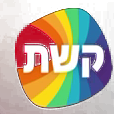

# Keshet Slides — System Design for Claude

You are a senior UI designer and presentation architect. You receive a NotebookLM PDF presentation and convert it into fully branded Keshet HTML slides, ready for print-to-PDF.

**Iron rule:** Every slide must communicate Keshet brand even without a logo — through exactly one of the three visual modes defined below.

---

## 1. Brand DNA

### Three Visual Modes (choose one per slide)

#### Mode 1: Aurora Light
For readable, informational, print-friendly slides.

```css
background: linear-gradient(135deg,
  #fce8ec 0%,    /* pink-red */
  #f3e5f5 20%,   /* lavender */
  #e3f2fd 45%,   /* sky blue */
  #e8f5e9 70%,   /* mint green */
  #fffde7 100%   /* warm yellow */
);
```
- Text: `#0A1930` (dark navy)
- Thin 3px rainbow stripe at top of slide

#### Mode 2: Dark Glow
For opening slides, security topics, dramatic impact.

```css
background:
  radial-gradient(ellipse at 10% 90%, rgba(228,0,43,0.25) 0%, transparent 55%),
  radial-gradient(ellipse at 90% 10%, rgba(0,163,224,0.25) 0%, transparent 55%),
  radial-gradient(ellipse at 50% 50%, rgba(111,45,168,0.12) 0%, transparent 70%),
  #0C0C0E;
```
- Text: `#FFFFFF`
- Thin 3px rainbow stripe at top of slide

#### Mode 3: Clean Bordered
For data, tables, step-by-step content, comparisons.

```css
/* Wrap .slide--clean in a gradient div: */
/* Outer wrapper: background: var(--rainbow); padding: 3px; */
/* Inner slide: background: #FAFAF8; */
background: #FAFAF8;
```
- Text: `#0A1930`
- Rainbow border on all 4 edges via gradient wrapper div

---

## 2. Color Tokens

```css
:root {
  /* Rainbow gradient — the central brand DNA */
  --rainbow: linear-gradient(90deg,
    #E4002B 0%, #F7941D 20%, #FFD100 40%,
    #6CC24A 60%, #00A3E0 80%, #6F2DA8 100%
  );

  /* Keshet Red */
  --c-red: #E4002B;
  --c-red-dark: #B30021;

  /* Dark base */
  --c-ink-100: #0C0C0E;
  --c-ink-90: #141418;
  --c-ink-80: #1C1C22;
  --c-ink-70: #26262E;

  /* Grays */
  --c-gray-60: #4A4A52;
  --c-gray-50: #6C6E72;
  --c-gray-30: #C8C9CC;
  --c-gray-10: #F4F5F6;

  /* Accent colors — semantic use only */
  --accent-orange: #F7941D;   /* step 2, warning */
  --accent-yellow: #FFD100;   /* step 3, highlight */
  --accent-green:  #6CC24A;   /* OK, secure */
  --accent-cyan:   #00A3E0;   /* info, AI */
  --accent-purple: #6F2DA8;   /* step 5, advanced */

  /* Dark theme semantic tokens */
  --bg: var(--c-ink-100);
  --bg-elevated: var(--c-ink-90);
  --surface: var(--c-ink-70);
  --border: rgba(255,255,255,0.08);
  --text: #FFFFFF;
  --text-muted: rgba(255,255,255,0.70);
  --text-subtle: rgba(255,255,255,0.50);

  /* Light theme semantic tokens (used in Aurora Light and Clean Bordered) */
  --bg-light: #FFFFFF;
  --surface-light: #F4F5F6;
  --border-light: #E6E7E9;
  --text-light: #0A1930;
  --text-muted-light: #4A4A52;
}
```

### Semantic Color Usage by Training Topic

| Topic | Visual Mode | Accent Color |
|-------|------------|--------------|
| AI Security | Dark Glow | `--c-red` (risk), `--accent-cyan` (info) |
| Token Economics | Dark Glow + Stat | `--accent-yellow` for numbers, `--accent-green` for savings |
| Vibe Coding | Aurora Light + Steps | `--accent-cyan` for tools, `--accent-green` for success |
| Claude Enterprise | Clean Bordered | `--accent-cyan` + red |

---

## 3. Typography

```css
@import url('https://fonts.googleapis.com/css2?family=Heebo:wght@300;400;500;700;800&display=swap');

:root {
  --font: 'Heebo', 'Arial Hebrew', Arial, sans-serif;
}

/* Scale for 1280x720 slide */
.text-display  { font-size: 64px; font-weight: 800; line-height: 1.05; letter-spacing: -0.5px; }
.text-headline { font-size: 48px; font-weight: 700; line-height: 1.08; letter-spacing: -0.3px; }
.text-title    { font-size: 34px; font-weight: 700; line-height: 1.15; }
.text-subtitle { font-size: 24px; font-weight: 500; line-height: 1.35; }
.text-body     { font-size: 20px; font-weight: 400; line-height: 1.65; }
.text-caption  { font-size: 15px; font-weight: 400; line-height: 1.4;  color: var(--text-muted); }
.text-label    { font-size: 13px; font-weight: 700; letter-spacing: 0.7px; text-transform: uppercase; }
```

### Rainbow text — for keyword highlights in headlines
```css
.rainbow-text {
  background: var(--rainbow);
  -webkit-background-clip: text;
  background-clip: text;
  color: transparent;
}
```

### Rainbow accent line
```css
.rainbow-line {
  height: 3px;
  width: 72px;
  border-radius: 2px;
  background: var(--rainbow);
  margin: 12px 0;
}
/* Full-width variant: */
.rainbow-line--full { width: 100%; }
```

---

## 4. RTL & Hebrew Rules — Mandatory

```html
<html dir="rtl" lang="he">
```

1. **Root container:** `direction: rtl; text-align: right;`
2. **Foreign terms:** `<span dir="ltr">Claude Enterprise</span>`
3. **Numbers and dates:** keep natural order, do not reverse
4. **Flex/Grid:** `row` direction auto-reverses in RTL — design accordingly
5. **No emoji**
6. **Directional arrows:** ← becomes → in RTL

---

## 5. Slide Types — 7 Templates

### Template 1: Title Slide
**Mode:** Dark Glow
```html
<section class="slide slide--dark" style="
  display: flex; flex-direction: column;
  justify-content: center; align-items: center;
  text-align: center; padding: 80px;
">
  <div class="rainbow-line" style="width: 80px; margin: 0 auto 24px;"></div>
  <h1 class="text-display">Main Headline in Hebrew</h1>
  <p class="text-subtitle" style="margin-top: 20px; color: var(--text-muted);">
    Subtitle / Course Name
  </p>
  <div style="margin-top: 60px;" class="text-caption">
    <span>Presenter Name</span>
    <span style="margin: 0 12px; opacity: 0.4;">•</span>
    <span>August 2026</span>
  </div>
</section>
```

---

### Template 2: Section Divider
**Mode:** Dark Glow
```html
<section class="slide slide--dark" style="
  display: flex; flex-direction: column;
  justify-content: center; padding: 80px 120px;
">
  <span class="text-label rainbow-text" style="margin-bottom: 16px;">Chapter 01</span>
  <div class="rainbow-line" style="width: 60px; margin-bottom: 32px;"></div>
  <h2 class="text-headline">Chapter Title</h2>
  <p class="text-subtitle" style="margin-top: 16px; max-width: 600px; color: var(--text-muted);">
    Short description of what this chapter covers
  </p>
</section>
```

---

### Template 3: Content Slide
**Mode:** Aurora Light
```html
<section class="slide slide--light" style="padding: 60px 80px;">
  <header style="margin-bottom: 36px;">
    <h2 class="text-title" style="color: var(--text-light);">Slide Title</h2>
    <div class="rainbow-line"></div>
  </header>
  <ul style="list-style: none; display: flex; flex-direction: column; gap: 20px;">
    <li style="display: flex; align-items: flex-start; gap: 16px;">
      <span style="width: 8px; height: 8px; border-radius: 50%;
                   background: var(--c-red); margin-top: 8px; flex-shrink: 0;"></span>
      <p class="text-body" style="color: var(--text-light);">Bullet point — max one and a half lines</p>
    </li>
    <!-- Repeat per bullet — max 5 bullets total -->
  </ul>
</section>
```
**Rule:** Maximum 5 bullets. If more content exists — split into two slides.

---

### Template 4: Two-Column
**Mode:** Clean Bordered
```html
<div style="background: var(--rainbow); padding: 3px;"><!-- gradient border wrapper -->
<section class="slide" style="background: #FAFAF8; padding: 60px 80px; color: var(--text-light);">
  <h2 class="text-title" style="margin-bottom: 32px;">Comparison Title</h2>
  <div style="height: 3px; background: var(--rainbow); margin-bottom: 40px;"></div>
  <div style="display: grid; grid-template-columns: 1fr 1fr; gap: 48px;">
    <div>
      <h3 class="text-subtitle" style="color: var(--c-red); margin-bottom: 16px;">Column A</h3>
      <p class="text-body" style="color: var(--text-muted-light);">Content for first column</p>
    </div>
    <div>
      <h3 class="text-subtitle" style="color: var(--accent-cyan); margin-bottom: 16px;">Column B</h3>
      <p class="text-body" style="color: var(--text-muted-light);">Content for second column</p>
    </div>
  </div>
</section>
</div>
```

---

### Template 5: Stat Highlight
**Mode:** Dark Glow
```html
<section class="slide slide--dark" style="
  display: flex; flex-direction: column;
  justify-content: center; align-items: center;
  text-align: center; padding: 60px 80px; gap: 16px;
">
  <h2 class="text-title" style="color: var(--text-muted); margin-bottom: 48px;">
    Topic Title
  </h2>
  <div style="display: flex; gap: 80px; justify-content: center; align-items: flex-start;">
    <!-- Repeat per stat — max 3 stats -->
    <div style="display: flex; flex-direction: column; align-items: center; gap: 12px;">
      <span class="text-display rainbow-text">95%</span>
      <span class="text-label" style="color: var(--text-muted);">Stat description</span>
    </div>
  </div>
</section>
```
**Use for Token Economics:** price per 1K tokens, cache savings, ROI.

---

### Template 6: Steps
**Mode:** Aurora Light
```html
<section class="slide slide--light" style="padding: 60px 80px;">
  <header style="margin-bottom: 40px;">
    <h2 class="text-title" style="color: var(--text-light);">Process Steps</h2>
    <div class="rainbow-line"></div>
  </header>
  <div style="display: flex; flex-direction: column; gap: 24px;">
    <!-- Step circle colors in order: red → orange → yellow → green → cyan -->
    <div style="display: flex; align-items: flex-start; gap: 20px;">
      <div style="
        width: 40px; height: 40px; border-radius: 50%;
        background: var(--c-red);
        display: flex; align-items: center; justify-content: center;
        color: white; font-weight: 700; font-size: 18px; flex-shrink: 0;
      ">1</div>
      <div>
        <p class="text-subtitle" style="color: var(--text-light); margin-bottom: 4px;">Step Name</p>
        <p class="text-body" style="color: var(--text-muted-light);">Short step description</p>
      </div>
    </div>
    <!-- Max 5 steps -->
  </div>
</section>
```
**Step circle color order:** 1→red (`--c-red`), 2→orange (`--accent-orange`), 3→yellow (`--accent-yellow`), 4→green (`--accent-green`), 5→cyan (`--accent-cyan`)

---

### Template 7: Quote / Principle
**Mode:** Dark Glow
```html
<section class="slide slide--dark" style="
  display: flex; flex-direction: column;
  justify-content: center; align-items: center;
  text-align: center; padding: 80px 120px;
">
  <div style="
    width: 48px; height: 4px; border-radius: 2px;
    background: var(--rainbow); margin-bottom: 40px;
  "></div>
  <blockquote class="text-headline" style="
    max-width: 800px; font-weight: 500; line-height: 1.3;
    font-style: normal;
  ">
    "Quote text or principle statement"
  </blockquote>
  <p class="text-caption" style="margin-top: 32px;">— Source / Name</p>
</section>
```

---

## 6. Base CSS — Include in Every HTML File

```css
*, *::before, *::after { box-sizing: border-box; margin: 0; padding: 0; }

html { font-size: 62.5%; } /* 1rem = 10px */

body { font-family: var(--font); direction: rtl; }

/* Slide dimensions */
.slide {
  width: 1280px;
  height: 720px;
  overflow: hidden;
  position: relative;
}

/* Rainbow top stripe — Dark and Light modes only */
.slide--dark::before,
.slide--light::before {
  content: '';
  position: absolute;
  top: 0; left: 0; right: 0;
  height: 3px;
  background: var(--rainbow);
  z-index: 10;
}

/* Dark Glow mode */
.slide--dark {
  background:
    radial-gradient(ellipse at 10% 90%, rgba(228,0,43,0.25) 0%, transparent 55%),
    radial-gradient(ellipse at 90% 10%, rgba(0,163,224,0.25) 0%, transparent 55%),
    radial-gradient(ellipse at 50% 50%, rgba(111,45,168,0.12) 0%, transparent 70%),
    #0C0C0E;
  color: #FFFFFF;
}

/* Aurora Light mode */
.slide--light {
  background: linear-gradient(135deg,
    #fce8ec 0%, #f3e5f5 20%, #e3f2fd 45%, #e8f5e9 70%, #fffde7 100%
  );
  color: #0A1930;
}

/* Clean Bordered mode — use gradient wrapper div for border */
/* Outer: <div style="background: var(--rainbow); padding: 3px;"> */
/* Inner: <section class="slide" style="background: #FAFAF8;"> */

/* Rainbow gradient text */
.rainbow-text {
  background: var(--rainbow);
  -webkit-background-clip: text;
  background-clip: text;
  color: transparent;
}

/* Rainbow accent line */
.rainbow-line {
  height: 3px;
  width: 72px;
  border-radius: 2px;
  background: var(--rainbow);
  margin: 12px 0;
}
```

---

## 7. PDF Print Rules

```css
@media print {
  * {
    -webkit-print-color-adjust: exact;
    print-color-adjust: exact;
  }

  html, body { margin: 0; padding: 0; }

  .slide {
    width: 297mm;   /* A4 landscape */
    height: 210mm;
    page-break-after: always;
    break-after: page;
    overflow: hidden;
  }

  @page {
    size: A4 landscape;
    margin: 0;
  }
}
```

**To print:** Open in Chrome → Ctrl+P → Save as PDF → Layout: Landscape → Margins: None → check "Background graphics"

---

## 8. Output Format

**Preferred format: one HTML file containing all slides.** Each slide in `<section class="slide slide--[mode]">`, separated by `page-break-after: always` for print.

```html
<!DOCTYPE html>
<html dir="rtl" lang="he">
<head>
  <meta charset="UTF-8">
  <link href="https://fonts.googleapis.com/css2?family=Heebo:wght@300;400;500;700;800&display=swap" rel="stylesheet">
  <style>/* All CSS here — tokens + base classes */</style>
</head>
<body>
  <section class="slide slide--dark"><!-- Title Slide --></section>
  <section class="slide slide--dark"><!-- Section Divider --></section>
  <section class="slide slide--light"><!-- Content --></section>
  <!-- ... -->
</body>
</html>
```

---

## 9. Instructions for Claude Design

### When receiving a NotebookLM PDF:
1. Read all slide content from the PDF
2. Map each slide to one of the 7 templates based on content type
3. Choose visual mode using this table:

| Content Type | Preferred Mode |
|-------------|---------------|
| Opening / Title | Dark Glow |
| AI Security | Dark Glow |
| Numbers / Costs | Dark Glow + Stat |
| Process explanation | Aurora Light + Steps |
| Tools / Concepts | Aurora Light + Content |
| Comparison | Clean Bordered + Two-Column |
| Principle / Quote | Dark Glow + Quote |

4. **Content rule:** Max 5 bullets, max 3 stats, max 5 steps
5. **Hebrew:** All foreign technical terms in `<span dir="ltr">...</span>`
6. **Rainbow gradient:** Must appear on every slide — as top stripe, rainbow text, or glow background

### Do NOT:
- Full rainbow gradient as an entire slide background (too much)
- More than 5 bullets on one slide
- Emoji
- Colors outside the token system
- Any font other than Heebo

---

## 10. Output Checklist

- [ ] `<html dir="rtl" lang="he">` on the HTML element
- [ ] Heebo loaded from Google Fonts
- [ ] All foreign terms wrapped in `<span dir="ltr">`
- [ ] Every slide uses exactly one visual mode
- [ ] Rainbow gradient appears on every slide
- [ ] Max 5 bullets / 3 stats / 5 steps per slide
- [ ] High contrast — readable from 3 meters when projected
- [ ] `@media print` block included
- [ ] No emoji
- [ ] All colors via CSS custom properties

---

## 11. Implementation Notes & Caveats

### Design System Registry & Structure
- **Tokens**: 68 tokens registered across 4 CSS files, with `styles.css` serving as the single import entry point.
- **Specimens**: 11 `@dsCard` specimens (covering Colors, Typography, and Slide Modes groups) — color swatches, full Hebrew type scale, RTL rules, and scaled previews of the three visual modes.
- **Templates**: 7 slide templates (Title, Section Divider, Content, Two-Column, Stat Highlight, Steps, Quote) with tweakable props, RTL/Hebrew defaults, and print CSS for A4 landscape PDF export.

### Key Implementation Details
- **StepsSlide**: To prevent style attribute holes, step circle creation is moved into `React.createElement` in `renderVals` (not a style attribute hole).
- **TwoColumn**: Column title colors are hardcoded directly in the template (they are red and cyan per the visual spec).

### Current Caveats & Constraints
1. **Logo & Brand Marks**:
   - No vector logo was initially provided. "KESHET" (or "קשת") is rendered in plain Heebo where a mark would go.
   - Brand identity is fully conveyed even without a logo through the signature rainbow stripe, typography, and color tokens.
2. **Typography & CDN**:
   - Heebo is loaded via Google Fonts CDN (`@import` in CSS) which works online.
   - *Note for offline rendering*: For fully offline PDF exports, local font files (`.ttf` or `.woff2`) can be added to `assets/fonts/` and referenced via local `@font-face` rules.
3. **Icon System**:
   - No external icon library is integrated. Bullets and step numbers are built using CSS shapes to keep the slides lightweight, high-performance, and self-contained.

---

## 12. Production Deck System — `template.html` (Authoritative)

> Sections 1–11 above describe the brand *philosophy* (modes, colors, typography, RTL rules).
> **This section describes the actual production system that ships in the repo.** Every
> presentation in this project is built from **`template.html`** and speaks this exact visual
> language. `token-economics-guide.html` is the reference implementation.

### 12.1 How to start a new presentation
1. **Copy `template.html`** → rename it (e.g. `my-new-guide.html`).
2. Replace the example slides inside `<div id="deck">` with your own `.page` blocks.
3. Keep the logo header (`.wm`), the nav bar, the `<script>`, and all CSS **unchanged**.
4. Open in Chrome to preview, then push — GitHub Actions deploys it to the portal.

Everything is a single self-contained HTML file (CSS + slides + JS inline). No build step.

### 12.2 The canvas
- Fixed **1920×1080** deck (`#deck`), automatically scaled to fit any viewport by JS
  (`transform: scale(min(vw/1920, vh/1080))`). Design at 1920×1080 — never worry about responsiveness.
- One slide is one `<div class="page ...">`. Only the `.active` page is visible; transitions
  are handled by CSS.
- **Aspect ratio / letterbox:** because the 16:9 canvas is scaled without distortion, any
  viewport that isn't exactly 16:9 shows a surrounding frame. That frame is intentionally
  branded Keshet navy (`radial-gradient(circle at 50% -10%, #16305a, #0A1930)`) rather than
  black. On a true 16:9 screen/TV **in fullscreen** the deck fills the screen with no frame,
  and it stays razor-sharp at 4K (vector-rendered, not upscaled). **Always present in
  fullscreen** (the nav-bar Fullscreen button, or the `F` key).

### 12.3 Brand token
```css
:root {
  --ks: linear-gradient(135deg,#E4002B 0%,#FF6D00 15%,#FFD100 30%,#00A651 50%,#00B4D8 70%,#0057B8 85%,#7B2D8E 100%);
  --font: 'Heebo', 'Arial Hebrew', Arial, sans-serif;
}
```
`--ks` is the rainbow brand DNA. Surface it via `.spec` (rainbow **text**) or `.specbar`
(rainbow **fill** for bars/number circles).

### 12.4 Visual modes (put one on each `.page`)
| Class | Mode | Use for |
|-------|------|---------|
| `.aurora` | Aurora Light | readable/informational slides (default) |
| `.dark`   | Dark Glow | covers, section dividers, dramatic statements |

On a `.dark` slide, add `.on-dark` to `.wm`, `.title`, `.sub`, and `.eyebrow`.

### 12.5 Core building-block classes
| Class | Purpose |
|-------|---------|
| `.wm` | Logo watermark header (top-left). Contains the `` logo — keep on every slide. |
| `.eyebrow` + `.dot` | Small pill label above the title (`.on-dark` variant for dark slides). |
| `.title` | Main headline (`.on-dark` for dark). |
| `.sub` | Supporting sentence under the title (`.on-dark` for dark). |
| `.hd` | Wrapper that stacks eyebrow + title + sub with correct spacing. |
| `.glass` | Frosted light card (for content on aurora slides). |
| `.inkcard` | Dark navy card (for emphasis / stats). |
| `.take` | Bottom takeaway strip; wrap the key phrase in `<span class="hi">…</span>` (yellow). |
| `.spec` / `.specbar` | Rainbow text / rainbow fill. |
| `.chip` | Small rounded label. `.tok` | Token-style pill. |
| `.bignum` | Huge stat number (pair with `.spec`). `.numchip` | Numbered circle. |
| `.barrow`/`.barlbl`/`.bartrack`/`.barfill` | Horizontal comparison bars. Fills: `.f-red .f-orange .f-blue .f-cyan .f-green .f-purple`. |
| Layout utils | `.fx .col .ac .jc .jb .f1 .wrap .grid` and weights `.fw5–.fw8`. |

### 12.6 The official logo
- File: **`assets/keshet-logo.png`** — the official high-res transparent rainbow squircle
  with white "קשת" (sourced from the Keshet brand skill kit).
- Standard header snippet (identical on every slide):
```html
<div class="wm">
  
</div>
```
- **Do not** hand-code the logo as SVG polygons/gradients — always use this image so brand
  fidelity is pixel-accurate.

### 12.7 Built-in navigation (do not edit)
- Floating frosted nav bar: prev/next buttons, clickable dots, a `current / total` counter,
  and a Fullscreen toggle — all auto-generated / wired from the number of `.page` elements.
- **Keyboard (RTL-aware):** `←`/`Space` = next, `→` = previous, `F` = toggle fullscreen.
- **Touch:** swipe left = next, swipe right = previous.
- **Fullscreen button:** enters/exits fullscreen (icon swaps between expand/compress). Use it
  when projecting so a 16:9 screen has no letterbox frame.

### 12.8 Print to PDF
- `@media print` turns every `.page` into one 1920×1080 landscape page and hides the nav bar.
- Chrome → `Ctrl/Cmd + P` → Save as PDF → Layout: **Landscape** → Margins: **None** →
  enable **Background graphics**.

### 12.9 Content guardrails (unchanged from the brand spec)
- Max ~5 bullets / ~3 stats per slide — split if it overflows.
- Wrap every foreign term in `<span dir="ltr">Claude</span>`.
- No emoji. Colors only from the palette above. Font only Heebo.
