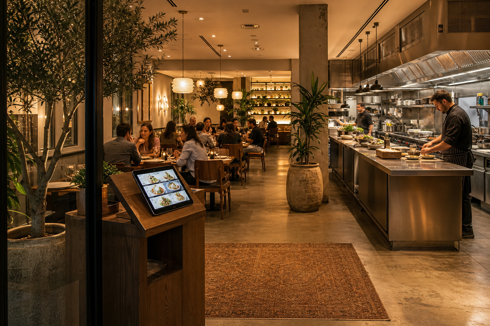
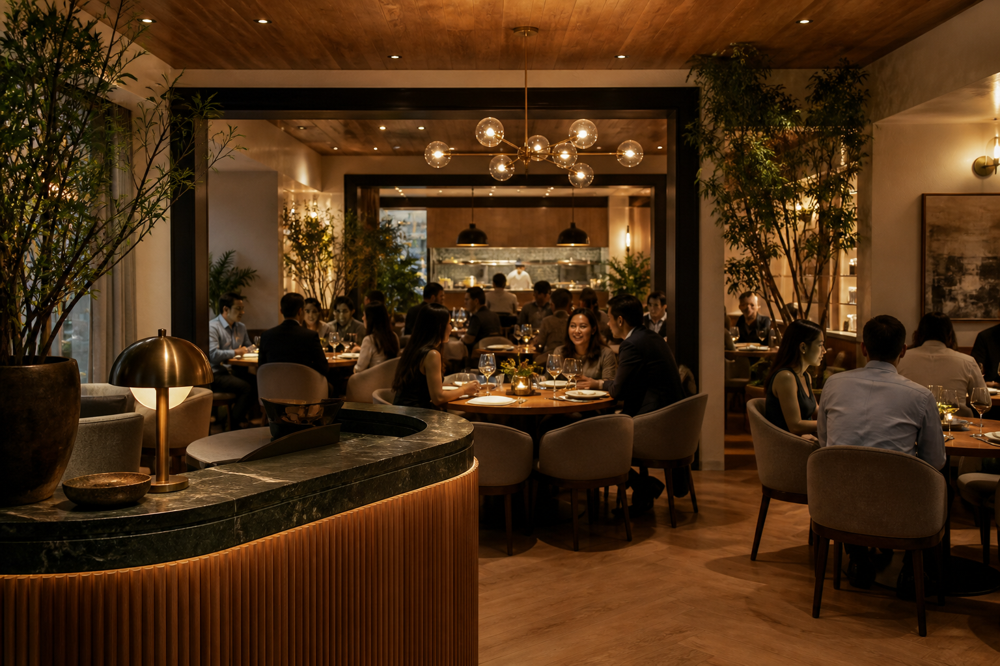
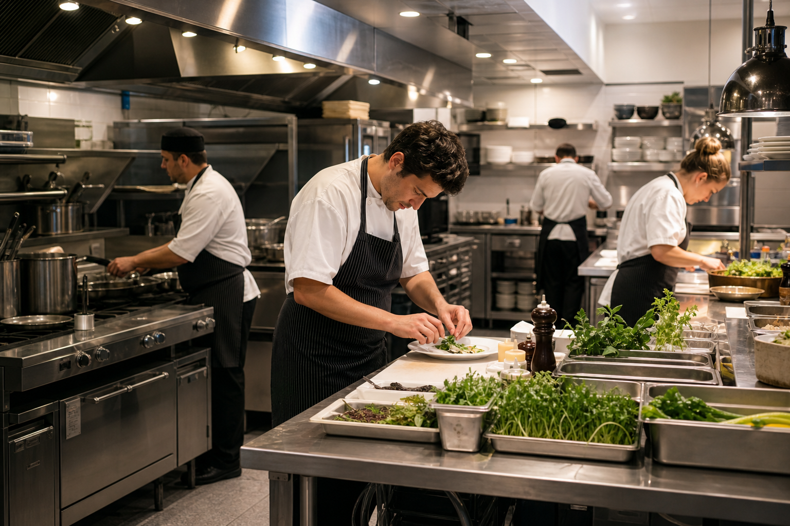
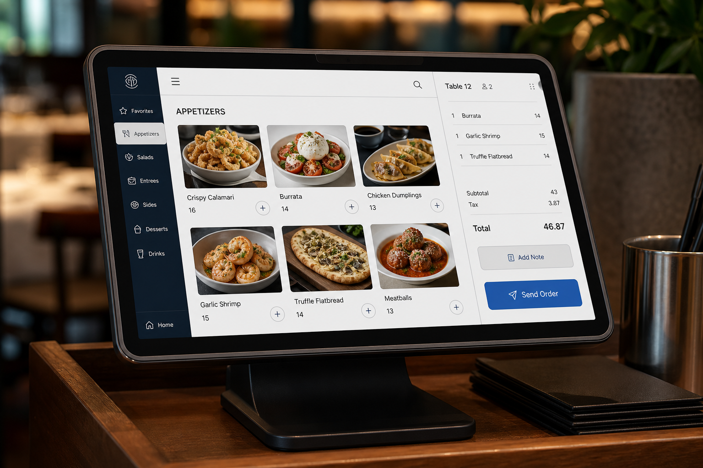

# Cursor Prompt — Image Generation for vibe-coding-guide.html

## Context

You are working on `vibe-coding-guide.html` — a Hebrew RTL slide deck for Keshet's internal builder training.

Two slides use the "restaurant as a metaphor for app architecture" analogy:
- **Slide 3** ("02 · מבוא" / "לפני שמתחילים — התמונה הגדולה") — shows the full restaurant as an establishing visual
- **Slide 4** ("03 · האנטומיה — 3 אזורים") — shows three zones side-by-side: dining room (Frontend), kitchen (Backend), ordering system (API)

The current images are either missing or cropped awkwardly. Your job is to generate all four images using **Nano Banana**, ensure they are proportionally fitted to their containers, and update the HTML accordingly.

---

## Step 1 — Generate the images using Nano Banana

Use Nano Banana (the image generation tool available in Cursor) to generate the following four images. Save them all inside the `assets/vibe/` folder relative to the HTML file.

---

### Image A — Slide 3: Full restaurant establishing shot

**Filename:** `assets/vibe/restaurant-full.png`

**Prompt to Nano Banana:**
> A warm, modern Israeli restaurant interior photographed from the entrance, showing all three areas in one wide shot: the **dining room** (guests seated at tables, soft lighting), the **open kitchen** (chefs cooking, stainless steel counters), and a **digital ordering tablet** on the host stand near the entrance. Clean, professional, slightly cinematic. No text or overlays. Wide aspect ratio (~16:9), well-lit, high quality.

**Target container in the HTML:**
```html

```
Make sure the image fills the height naturally without cropping. If the generated image is portrait-oriented, regenerate with explicit landscape orientation.

---

### Image B — Slide 4, Zone 1: Dining room (Frontend)

**Filename:** `assets/vibe/restaurant-dining.png`

**Prompt to Nano Banana:**
> A modern restaurant dining room seen from behind the host stand. Round tables, warm ambient lighting, guests dining. Clean and inviting. No text. Square or slightly landscape crop (1:1 to 4:3 ratio). High quality.

---

### Image C — Slide 4, Zone 2: Kitchen (Backend)

**Filename:** `assets/vibe/restaurant-kitchen.png`

**Prompt to Nano Banana:**
> A professional restaurant kitchen — chefs working at stainless steel prep stations, organized mise en place, bright overhead lighting. No guests visible. No text. Square or slightly landscape crop (1:1 to 4:3 ratio). High quality.

---

### Image D — Slide 4, Zone 3: Ordering / POS system (API)

**Filename:** `assets/vibe/restaurant-pos.png`

**Prompt to Nano Banana:**
> A close-up of a modern digital ordering tablet / POS terminal mounted on a restaurant host stand or waiter station. Clean interface showing a menu order screen. No text overlays in Hebrew. Square or slightly landscape crop (1:1 to 4:3 ratio). High quality.

---

## Step 2 — Update slide 3 HTML

Find slide 3 (the `<!-- 03 -->` or `<!-- 02 · מבוא -->` comment, the slide titled "לפני שמתחילים — התמונה הגדולה").

Locate the image or placeholder inside it. Replace it with:

```html
<div style="display:flex;justify-content:center;margin-top:16px;">
  
</div>
```

**Rules:**
- `height:420px` is the maximum — do NOT exceed this.
- `width:auto` — the image sets its own width based on its natural aspect ratio.
- `max-width:1600px` — prevents overflow on very wide landscape images.
- `object-fit:contain` — never crop the image.
- `display:flex; justify-content:center` on the wrapper — centers the image horizontally.

---

## Step 3 — Update slide 4 HTML (three zone images)

Find slide 4 (the `<!-- 04 האנטומיה -->` comment, the slide titled "האנטומיה של אפליקציה: מסעדת הנתונים").

This slide has three `.glass` zone cards in a 3-column grid. Each card represents one zone. Update the image inside each card as follows:

**Zone 1 card — Dining Room (Frontend):**
Replace the existing `` or placeholder with:
```html

```

**Zone 2 card — Kitchen (Backend):**
```html

```

**Zone 3 card — POS / API:**
```html

```

**Rules:**
- All three images **must use identical dimensions**: `width:100%; height:200px`.
- `object-fit:cover` fills the box cleanly — slight cropping is acceptable to maintain symmetry.
- Do NOT use different heights for different cards.
- The image goes **at the top** of its card `<div>`, before the text content.

---

## Step 4 — Proportionality verification

After inserting all images, visually verify the following:

1. The three zone cards on slide 4 are **visually symmetric** — same width, same image height, same padding.
2. The full restaurant image on slide 3 does **not overflow** beyond the slide canvas (1920×1080 at the current scale).
3. No image appears **stretched or distorted** (width ≠ intrinsic ratio). If it does, switch back to `object-fit:contain` for that image.
4. On slide 3, if the image looks too tall (pushes other content off-screen), reduce `height` from `420px` to `360px`.

---

## Step 5 — Final check

- Verify `assets/vibe/` folder contains all four files: `restaurant-full.png`, `restaurant-dining.png`, `restaurant-kitchen.png`, `restaurant-pos.png`.
- Verify no `` tag uses `height: auto; width: auto` (that causes layout shifts).
- Verify slide 3 still has the `.take` strip visible at the bottom — the image must not push it off-screen.
